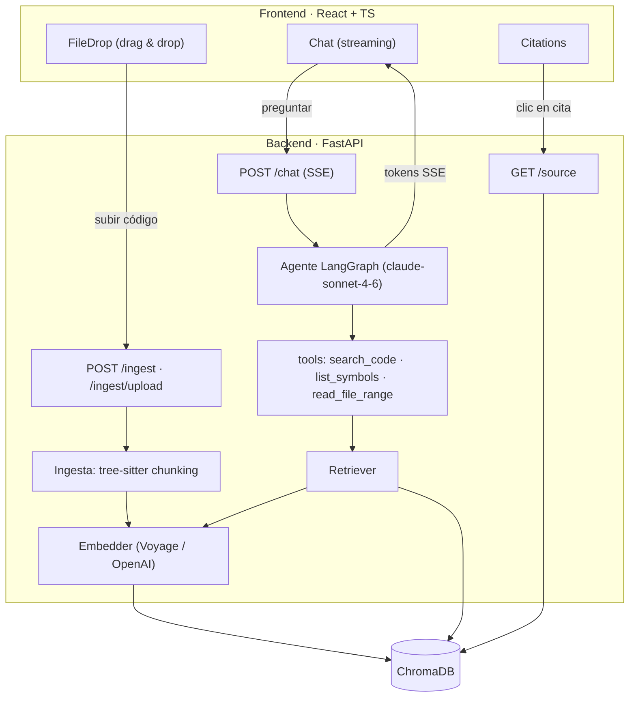

# Dev Context Assistant

Agente que indexa una codebase y responde preguntas técnicas sobre ella (qué hace un
método, dependencias, dónde puede fallar, cómo migrar algo) **con citas al fichero y
línea de origen**. RAG real + agente con herramientas + full stack.

- **RAG real:** ingestión → chunking por símbolo (tree-sitter) → embeddings → búsqueda vectorial.
- **Agente con tools:** decide cuándo buscar en el código vs. responder desde contexto.
- **Citas verificables:** cada afirmación basada en código se cita como `path:inicio-fin`.
- **Full stack:** backend Python + frontend React/TS con respuesta en **streaming**.
- **Agnóstico de lenguaje:** indexa Python, JS/TS (y más vía tree-sitter); fallback por líneas.

## Stack

| Capa | Tecnología |
|---|---|
| Backend | Python 3.12 (uv), FastAPI, Uvicorn |
| Agente | LangGraph (`create_agent`) + `claude-sonnet-4-6` (langchain-anthropic) |
| Embeddings | Voyage `voyage-3` (por defecto) · OpenAI `text-embedding-3-small` (alt.) |
| Vector store | ChromaDB local (interfaz `VectorStore` desacoplada → pgvector futuro) |
| Parsing | tree-sitter (chunking por símbolo) + fallback por ventana de líneas |
| Frontend | React + TypeScript + Vite (chat con streaming, drag & drop, panel de citas) |
| Calidad | ruff, pytest, mypy · oxlint (frontend) |

## Arquitectura



El agente recibe la pregunta y decide: responder directo o llamar a las tools. `search_code`
busca en el índice vectorial; `list_symbols` lista funciones/clases/métodos de un fichero;
`read_file_range` devuelve líneas exactas para citar con precisión. La memoria de sesión
(por `session_id`) la da el checkpointer de LangGraph.

## Endpoints

| Método | Ruta | Descripción |
|---|---|---|
| `GET` | `/health` | Estado del servicio. |
| `POST` | `/ingest` | Indexa una ruta (carpeta/fichero) del **disco del servidor** (`{"path": "..."}`). |
| `POST` | `/ingest/upload` | Indexa ficheros **subidos** (multipart) desde el navegador. |
| `POST` | `/chat` | Pregunta; responde en **streaming SSE** (eventos `token`/`done`/`error`). |
| `GET` | `/source` | Devuelve el fragmento exacto de un fichero indexado (panel de citas). |

## Estructura

```
dev-context-assistant/
├── PLAN.md              # plan vivo por fases
├── .env.example         # variables de entorno documentadas
├── .claude/skills/      # skills del proyecto (code-ingestion, rag-retrieval, agent-tools)
├── backend/             # FastAPI + uv
│   ├── Dockerfile
│   ├── app/
│   │   ├── api/         # routers: ingest, chat, source, deps
│   │   ├── ingestion/   # languages, loader, chunker, indexer (tree-sitter)
│   │   ├── rag/         # embedder, vector_store, retriever, context, source
│   │   ├── agent/       # graph (LangGraph) + tools
│   │   ├── core/        # settings (.env), logging
│   │   └── models/      # schemas Pydantic
│   └── tests/
└── frontend/            # Vite + React + TS
    └── src/{components,lib}/
```

## Configuración (`.env`)

Copia [`.env.example`](.env.example) a `.env` y rellena las claves. **Las claves no se piden
en código**: si falta una variable requerida por una funcionalidad, el backend falla con un
mensaje claro indicando cuál (p. ej. `Falta ANTHROPIC_API_KEY, requerida para el agente LLM`).

| Variable | Requerida para | Por defecto |
|---|---|---|
| `ANTHROPIC_API_KEY` | el agente (`/chat`) | — |
| `VOYAGE_API_KEY` | embeddings si `EMBEDDINGS_PROVIDER=voyage` | — |
| `OPENAI_API_KEY` | embeddings si `EMBEDDINGS_PROVIDER=openai` | — |
| `EMBEDDINGS_PROVIDER` | proveedor de embeddings | `voyage` |
| `CORS_ORIGINS` | orígenes del frontend | `http://localhost:5173` |

## Arranque (desarrollo)

### Backend
```bash
cd backend
cp ../.env.example ../.env   # y rellena las claves
uv run uvicorn app.main:app --reload
# Salud: http://127.0.0.1:8000/health
```

### Frontend

Requiere Node ≥ 22.12 (Vite 8). El repo fija la versión en [`frontend/.nvmrc`](frontend/.nvmrc):
```bash
cd frontend
nvm use          # activa la versión de .nvmrc
npm install
npm run dev      # http://localhost:5173
```

### Docker (backend)
```bash
docker build -t dev-context-assistant backend/
docker run --rm -p 8000:8000 --env-file .env dev-context-assistant
```

## Ejecutar 100% local con Ollama (Gemma)

El proveedor de LLM y el de embeddings son configurables: con [Ollama](https://ollama.com)
el proyecto corre **sin claves cloud**. El modelo de chat debe **soportar tool calling**
(p. ej. `gemma4`), imprescindible para que el agente use sus herramientas.

```bash
ollama pull gemma4              # LLM del agente (con soporte de tools)
ollama pull nomic-embed-text    # modelo de embeddings
```

En `.env`:
```ini
LLM_PROVIDER=ollama
OLLAMA_MODEL=gemma4
EMBEDDINGS_PROVIDER=ollama
OLLAMA_EMBED_MODEL=nomic-embed-text
# OLLAMA_BASE_URL=http://localhost:11434
```

Arranca el backend como siempre (`uv run uvicorn app.main:app`). Las respuestas y las
citas funcionan igual, pero generadas en local. Cualquier proveedor puede mezclarse
(p. ej. LLM en Ollama y embeddings en Voyage).

## Demo (2 minutos)

1. Arranca backend y frontend (o el backend en Docker).
2. **Arrastra una carpeta de código** al panel izquierdo → se indexa (verás ficheros/chunks).
3. **Pregunta** en el chat → la respuesta llega **en streaming**, citando `path:inicio-fin`.
4. **Clic en una cita** del panel derecho → muestra el fragmento exacto del fichero.

## Dogfooding

El agente puede indexar y responder sobre **su propio repositorio**. Indexa el backend:

```bash
curl -X POST http://127.0.0.1:8000/ingest \
  -H 'Content-Type: application/json' \
  -d '{"path": "backend/app"}'
# -> {"files_indexed": 29, "chunks_indexed": 79, "skipped": 0, "languages": {"python": 79}}
```

Tres preguntas de ejemplo (cada respuesta debe citar el fichero y la línea):

1. **¿Cómo se trocea el código y qué metadatos guarda cada chunk?**
   _(→ `ingestion/chunker.py`, `models/chunk.py`)_
2. **¿Qué herramientas tiene el agente y cómo decide cuándo usarlas?**
   _(→ `agent/tools.py`, `agent/graph.py`)_
3. **¿Cómo se valida que existan las claves de API y qué pasa si falta una?**
   _(→ `core/settings.py`)_

## Tests y calidad

```bash
# Backend (tests offline, sin red ni claves)
cd backend && uv run pytest -q && uv run ruff check && uv run mypy app

# Frontend
cd frontend && npm run build && npm run lint
```

Los tests del backend usan un `FakeEmbedder` determinista y un `ScriptedChatModel`, de modo
que toda la suite corre **sin red ni claves**.
